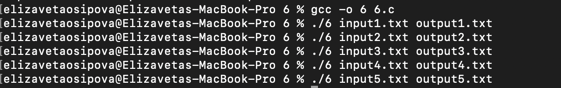
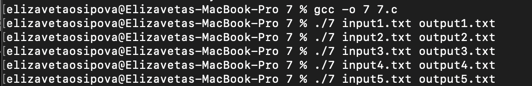
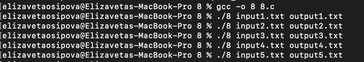

## Домашнее задание №1

### Осипова Елизавета Владимировна - БПИ-219

### Вариант №16 <br>

##### Разработать программу, которая вычисляет количество цифр и букв в заданной ASCII-строке.

## 4 балла

Разработано консольное приложение, использующее неименованные каналы, обеспечивающее взаимодействие по следующей схеме:
• первый процесс читает текстовые данные из заданного файла и через неименованный канал передает их второму процессу;
• второйпроцессосуществляетобработкуданныхвсоответствии с заданием и передает результат обработки через неименован- ный канал третьему процессу;
• третий процесс осуществляет вывод данных в заданный файл.

Схема решаемой задачи:

    +--------+     +--------+     +--------+
    | Процесс|     | Процесс|     | Процесс|
    |   1    |     |   2    |     |   3    |
    +--------+     +--------+     +--------+
        |               |               |
        |     pipe1     |     pipe2     |
        |               |               |
        |<--------------|               |
        |               |--------------->|
        |               |               |
        |               |     pipe3     |
        |               |               |
        |               |<--------------|
        |               |               |
        |               |     write     |
        |               |-------------->|
        |               |               |
        |               |     close     |
        |               |<--------------|
        |               |               |
        |     read      |               |
        |-------------->|               |
        |               |               |
        |               |               |
        |               |               |
        |               |               |
        |     close     |               |
        |<--------------|               |
        |               |               |

Данная программа решает задачу подсчета количества цифр и букв в текстовом файле. Она использует три процесса, связанных между собой через два канала:

Первый процесс (pid1) открывает входной файл (имя передается через первый аргумент командной строки) и читает его содержимое в буфер. Затем он записывает содержимое в первый канал (p1[1]) и закрывает оба конца канала (p1[0] и p1[1]).
Второй процесс (pid2) читает данные из первого канала (p1[0]) и подсчитывает количество цифр и букв в полученном тексте. Затем он записывает результат во второй канал (p2[1]) и закрывает оба конца канала (p2[0] и p2[1]).
Третий процесс (pid3) читает данные из второго канала (p2[0]) и записывает результат в выходной файл (имя передается через второй аргумент командной строки).
После завершения всех процессов основной процесс (родительский) ждет их завершения и завершается сам.

Имена каналов: p1 и p2. Каналы создаются с помощью системного вызова pipe().


Ввод и вывод данных при работе с файлами осуществляется через системные вызовы read и write.

Размеры буферов для хранения вводимых данных и результатов обработки должны быть не менее 5000 байт.

Тестирование программы:

[input1.txt](4%2Finput1.txt) - входные данные (тест 1)<br>
[output1.txt](4%2Foutput1.txt) - выходные данные (тест 1)<br>

[input2.txt](4%2Finput2.txt) - входные данные (тест 2)<br>
[output2.txt](4%2Foutput2.txt) - выходные данные (тест 2)<br>

[input3.txt](4%2Finput3.txt) - входные данные (тест 3)<br>
[output3.txt](4%2Foutput3.txt) - выходные данные (тест 3)<br>

[input4.txt](4%2Finput4.txt) - входные данные (тест 4)<br>
[output4.txt](4%2Foutput4.txt) - выходные данные (тест 4)<br>

[input5.txt](4%2Finput5.txt) - входные данные (тест 5)<br>
[output5.txt](4%2Foutput5.txt) - выходные данные (тест 5)<br>

## 5 баллов

Разработано консольное приложение, использующее именованные каналы, обеспечивающее взаимодействие по следующей схеме:<br>
• первый процесс читает текстовые данные из заданного файла и через именованный канал передает их второму процессу;<br>
• второйпроцессосуществляетобработкуданныхвсоответствии с заданием и передает результат обработки через именованный канал третьему процессу;<br>
• третий процесс осуществляет вывод данных в заданный файл.<br>


```
                   +-----------------+
                   |    input_file   |
                   +-----------------+
                            |
                            |
                            |
                   +-----------------+
                   |   Child Process |
                   | 1 (Write Data)  |
                   +-----------------+
                            |
                            |
                            |
                    +---------------+
                    | /tmp/p1_pipe  |
                    +---------------+
                            |
                            |
                            |
                   +-----------------+
                   |   Child Process |
                   | 2 (Count Digits |
                   |   and Letters)  |
                   +-----------------+
                            |
                            |
                            |
                    +--------------+
                    | /tmp/p2_pipe |
                    +--------------+
                            |
                            |
                            |
                   +-----------------+
                   |   Child Process |
                   | 3 (Write Result |
                   |     to Output)  |
                   +-----------------+
                            |
                            |
                            |
                   +-----------------+
                   |   output_file   |
                   +-----------------+

```

Общая схема решаемой задачи:

Создание двух именованных каналов: p1_pipe и p2_pipe с помощью функции mkfifo().<br>
Создание трех дочерних процессов:<br>
a. Дочерний процесс 1 открывает входной файл (filename1) и записывает данные из него в именованный канал p1_pipe.<br>
b. Дочерний процесс 2 считывает данные из именованного канала p1_pipe, подсчитывает количество цифр и букв в данных, и записывает результат в именованный канал p2_pipe.<br>
c. Дочерний процесс 3 открывает выходной файл (filename2) и записывает данные из именованного канала p2_pipe в него.<br>
Родительский процесс ожидает завершения всех дочерних процессов с помощью функции waitpid().<br>
Удаление именованных каналов p1_pipe и p2_pipe с помощью функции unlink().<br>
Имена каналов: p1_pipe и p2_pipe.<br>
Способ создания: функция mkfifo().<br>


[input1.txt](5%2Finput1.txt) - входные данные (тест 1)<br>
[output1.txt](5%2Foutput1.txt) - выходные данные (тест 1)<br>

[input2.txt](5%2Finput2.txt) - входные данные (тест 2)<br>
[output2.txt](5%2Foutput2.txt) - выходные данные (тест 2)<br>

[input3.txt](5%2Finput3.txt) - входные данные (тест 3)<br>
[output3.txt](5%2Foutput3.txt) - выходные данные (тест 3)<br>

[input4.txt](5%2Finput4.txt) - входные данные (тест 4)<br>
[output4.txt](5%2Foutput4.txt) - выходные данные (тест 4)<br>

[input5.txt](5%2Finput5.txt) - входные данные (тест 5)<br>
[output5.txt](5%2Foutput5.txt) - выходные данные (тест 5)<br>

## 6 баллов

Разработано консольное приложение, использующее неименованные каналы, обеспечивающее взаимодействие по следующей схеме:
• первый процесс читает текстовые данные из заданного файла и через неименованный канал передает их второму процессу;
• второйпроцессосуществляетобработкуданныхвсоответствии с заданием и передает результат обработки через неименованный канал обратно первому процессу;
• первый процесс осуществляет вывод данных в заданный файл.


Данная программа решает задачу подсчета количества цифр и букв в текстовом файле. Общая схема решения задачи представлена следующим образом:

1) Проверка количества аргументов командной строки.<br>
2) Создание неименованного канала при помощи функции pipe().<br>
3) Создание двух дочерних процессов при помощи функции fork().<br>
4) Дочерний процесс 1 открывает входной файл и записывает его содержимое в канал.<br>
5) Дочерний процесс 2 считывает данные из канала и подсчитывает количество цифр и букв.<br>
6) Дочерний процесс 2 записывает результат подсчета в выходной файл.<br>
7) Родительский процесс закрывает файловые дескрипторы канала и ожидает завершения работы дочерних процессов.<br>
8) Завершение работы программы.<br>
Входной файл и выходной файл передаются в качестве аргументов командной строки и имеют имена argv[1] и argv[2] соответственно. Неименованный канал создается при помощи функции pipe(), которая возвращает массив из двух файловых дескрипторов, хранящихся в переменной fd. Дочерние процессы получают доступ к этим файловым дескрипторам и используют их для передачи данных друг другу. <br>

Имена каналов в данной программе не задаются явно, поскольку используется неименованный канал. Создание канала происходит автоматически при вызове функции pipe(). <br>



[input1.txt](6%2Finput1.txt) - входные данные (тест 1)<br>
[output1.txt](6%2Foutput1.txt) - выходные данные (тест 1)<br>

[input2.txt](6%2Finput2.txt) - входные данные (тест 2)<br>
[output2.txt](6%2Foutput2.txt) - выходные данные (тест 2)<br>

[input3.txt](6%2Finput3.txt) - входные данные (тест 3)<br>
[output3.txt](6%2Foutput3.txt) - выходные данные (тест 3)<br>

[input4.txt](6%2Finput4.txt) - входные данные (тест 4)<br>
[output4.txt](6%2Foutput4.txt) - выходные данные (тест 4)<br>

[input5.txt](6%2Finput5.txt) - входные данные (тест 5)<br>
[output5.txt](6%2Foutput5.txt) - выходные данные (тест 5)<br>


Также реализован такой вариант решения задачи:<br>

[6_dop.c](6%2F6_dop.c)

Данная программа решает задачу подсчета количества букв и цифр в текстовом файле. Общая схема решаемой задачи включает следующие процессы и их связи:

Главный процесс запускает два дочерних процесса: первый процесс для чтения файла, подсчета количества букв и цифр, записи результатов в выходной файл и записи данных в канал; второй процесс для чтения данных из канала.<br>
Первый процесс открывает входной файл для чтения и выходной файл для записи. Он считывает данные из входного файла блоками размером BUFFER_SIZE, подсчитывает количество букв и цифр и записывает результаты в выходной файл. Также он записывает данные в канал, который будет использоваться вторым процессом.<br>
Второй процесс читает данные из канала и ничего не делает с ними.<br>
Главный процесс закрывает канал для чтения и записи и ждет завершения обоих дочерних процессов.<br>
Имена каналов не указаны в программе, потому что используется неименованный канал, который создается функцией pipe(). Эта функция создает два файловых дескриптора, которые связываются с каналом. Эти дескрипторы используются для чтения и записи данных в канал.<br>

Входной и выходной файлы указываются в командной строке при запуске программы. Если количество аргументов командной строки не равно 3, то выводится сообщение об использовании программы и программа завершается с ошибкой.

## 7 баллов

Разработано консольное приложение, использующее именованные каналы, обеспечивающее взаимодействие по следующей схеме:
• первый процесс читает текстовые данные из заданного файла и через именованный канал передает их второму процессу;
• второйпроцессосуществляетобработкуданныхвсоответствии с заданием и передает результат обработки через именованный канал обратно первому процессу;
• первый процесс осуществляет вывод данных в заданный файл.

Данная программа решает задачу подсчета количества цифр и букв в текстовом файле. Общая схема решения задачи представлена следующим образом:

1) Проверка количества переданных аргументов командной строки, которое должно быть равно 3.
2) Создание именованного канала с помощью функции mkfifo(). Название канала задается переменной pipe_name.
3) Создание двух дочерних процессов с помощью функции fork(): pid1 и pid2.
4) В дочернем процессе 1 (pid1) открывается файл, имя которого передается первым аргументом командной строки (input_file), и канал на запись (pipe_fd). Данные из файла считываются в буфер buffer размером BUFFER_SIZE и записываются в канал с помощью функции write().
5) В дочернем процессе 2 (pid2) открывается канал на чтение (pipe_fd) и файл для записи результата, имя которого передается вторым аргументом командной строки (output_file). Данные из канала считываются в буфер buffer и происходит подсчет количества цифр и букв в буфере с помощью функций isdigit() и isalpha(). Результат подсчета записывается в строку result_buffer с помощью функции snprintf(), а затем записывается в выходной файл с помощью функции write().
6) Родительский процесс ждет завершения работы обоих дочерних процессов с помощью функции waitpid().
7) Именованный канал удаляется с помощью функции unlink().

Таким образом, общая схема решаемой задачи включает создание именованного канала, два дочерних процесса, обмен данными между процессами через канал и запись результата в выходной файл.



[input1.txt](7%2Finput1.txt) - входные данные (тест 1)<br>
[output1.txt](7%2Foutput1.txt)- выходные данные (тест 1)<br>

[input2.txt](7%2Finput2.txt) - входные данные (тест 2)<br>
[output2.txt](7%2Foutput2.txt) - выходные данные (тест 2)<br>

[input3.txt](7%2Finput3.txt) - входные данные (тест 3)<br>
[output3.txt](7%2Foutput3.txt) - выходные данные (тест 3)<br>

[input4.txt](7%2Finput4.txt) - входные данные (тест 4)<br>
[output4.txt](7%2Foutput4.txt) - выходные данные (тест 4)<br>

[input5.txt](7%2Finput5.txt) - входные данные (тест 5)<br>
[output5.txt](7%2Foutput5.txt) - выходные данные (тест 5)<br>


## 8 баллов

[8_1.c](8%2F8_1.c) - первый процесс

[8_2.c](8%2F8_2.c) - второй процесс

Разработано консольное приложение, использующее именованные каналы, обеспечивающее взаимодействие по следующей схеме: <br>
• первый процесс читает текстовые данные из заданного файла и через именованный канал передает их второму процессу; <br>
• второй процесс осуществляет обработку данных в соответствии с заданием и передает результат обработки через именованный канал обратно первому процессу; <br>
• первый процесс осуществляет вывод данных в заданный файл.<br>

```
+-------------+       +-------------------+        +--------------+
|             |       |                   |        |              |
| input_file  +-------+       child       +--------+ fifo_name    |
|             |  ---->|     process       |<-------+              |
+-------------+       |                   |        +--------------+
                      +-------------------+
                                |
                                |
                                |
                                |
                      +-------------------+
                      |                   |
                      | output_file       |
                      |                   |
                      +-------------------+

```


Данная программа решает задачу подсчета количества цифр и букв в текстовом файле. Для этого она использует механизмы межпроцессного взаимодействия через FIFO (First In First Out) канал.
Программа создает FIFO канал с именем "/tmp/my_fifo" с правами на чтение и запись для всех пользователей (0666). Затем она создает новый процесс с помощью функции fork(). В этом процессе происходит открытие файла с именем, переданным в качестве первого аргумента программе (input_file), и чтение его содержимого в буфер buf размера MAX_BUF с помощью функции read(). Затем данные записываются в FIFO канал с помощью функции write(). После этого процесс завершается.
В основном процессе программа открывает FIFO канал для чтения, и также использует функцию read() для чтения данных из канала в буфер buf. Затем программа проходит по каждому символу из буфера buf и проверяет, является ли он цифрой или буквой с помощью функций isdigit() и isalpha(). После того, как все данные были прочитаны и обработаны, программа открывает файл с именем, переданным в качестве второго аргумента (output_file), для записи результата. Используя функцию dprintf() программа записывает результаты подсчета количества цифр и букв в выходной файл. Затем программа завершает работу, ожидая завершения дочернего процесса с помощью функции wait().
Таким образом, в данной программе используется два процесса для чтения данных из файла и подсчета количества цифр и букв в этих данных. Между процессами происходит межпроцессное взаимодействие с помощью FIFO канала. Имя канала "/tmp/my_fifo" и оно создается с помощью функции mkfifo(). Входной файл передается программе в качестве первого аргумента, выходной файл - в качестве второго аргумента.




[input1.txt](8%2Finput1.txt) - входные данные (тест 1)<br>
[output1.txt](8%2Foutput1.txt) - выходные данные (тест 1)<br>

[input2.txt](8%2Finput2.txt) - входные данные (тест 2)<br>
[output2.txt](8%2Foutput2.txt) - выходные данные (тест 2)<br>

[input3.txt](8%2Finput3.txt) - входные данные (тест 3)<br>
[output3.txt](8%2Foutput3.txt) - выходные данные (тест 3)<br>

[input4.txt](8%2Finput4.txt) - входные данные (тест 4)<br>
[output4.txt](8%2Foutput4.txt) - выходные данные (тест 4)<br>

[input5.txt](8%2Finput5.txt) - входные данные (тест 5)<br>
[output5.txt](8%2Foutput5.txt) - выходные данные (тест 5)<br>


